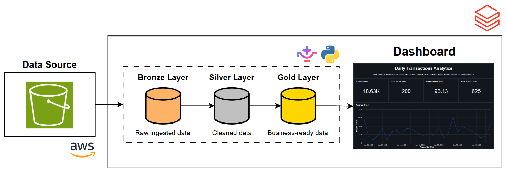
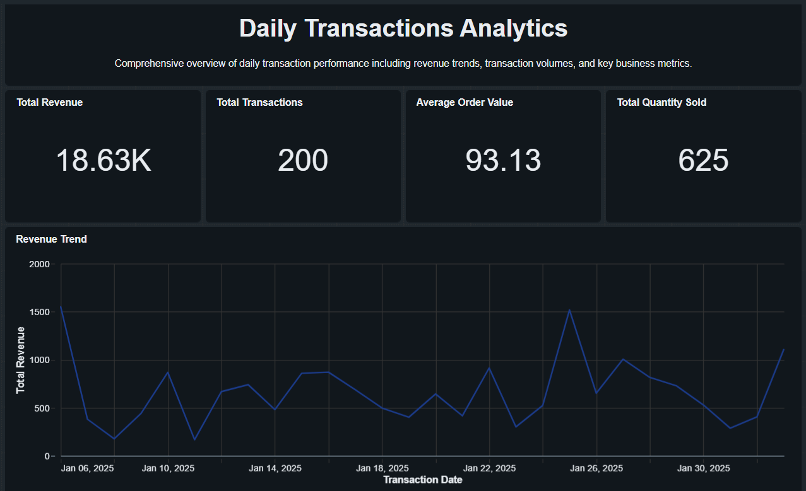

# Transactions Analytics Pipeline — Databricks & AWS

An automated data engineering pipeline built on Databricks that ingests, transforms, and visualizes transactional data using a **Medallion Architecture** (Bronze / Silver / Gold) with help of (Databrick Genie Code)[https://docs.databricks.com/aws/en/genie-code/].




---

## Overview

This project delivers a complete, production-ready data pipeline that:

- Ingests CSV data from AWS S3 into Databricks
- Processes data through Bronze → Silver → Gold layers using Delta Live Tables (DLT)
- Automates pipeline execution via table-update triggers
- Visualizes key business metrics through an interactive Lakeview dashboard

---

## Technologies

| Component        | Tool / Service                          |
|------------------|-----------------------------------------|
| Platform         | Databricks (Serverless Compute)         |
| Data Processing  | Delta Live Tables (DLT)                 |
| Storage          | Unity Catalog                           |
| Orchestration    | Databricks Workflows                    |
| Visualization    | Lakeview Dashboards                     |
| File Format      | Delta Lake                              |
| Data Source      | AWS S3                                  |

---

## Project Structure

```
Transactions-Analytics-Pipeline-Using-Databricks-and-AWS/
├── Data/
│   ├── transactions_2025_01_06.csv
│   ├── transactions_2025_01_13.csv
│   ├── transactions_2025_01_20.csv
│   ├── transactions_2025_01_27.csv
├── Images/
│   ├── Dashboard.png
│   ├── Project_Architecture.png
├── Pipeline/
│   ├── bronze/
│   │   └── bronze_transactions.sql
│   ├── silver/
│   │   └── silver_transactions.sql
│   └── gold/
│       ├── gold_daily_transactions.sql
└── README.md

```

---

## Data Schema

**Source Table:** `transactions`

| Column           | Type      | Description                        |
|------------------|-----------|------------------------------------|
| transaction_id   | STRING    | Unique transaction identifier      |
| transaction_date | TIMESTAMP | Date and time of transaction       |
| customer_id      | STRING    | Customer identifier                |
| product_id       | STRING    | Product identifier                 |
| product_name     | STRING    | Product name                       |
| category         | STRING    | Product category                   |
| quantity         | LONG      | Number of items purchased          |
| unit_price       | DOUBLE    | Price per unit                     |
| total_amount     | DOUBLE    | Total transaction amount           |
| store_location   | STRING    | Store location                     |
| payment_method   | STRING    | Payment method used                |
| _rescued_data    | STRING    | Malformed data rescue column       |

---

## Setup Guide

### Prerequisites

- Databricks workspace with Unity Catalog enabled
- AWS S3 bucket containing the source CSV files from Data folder
- IAM permissions configured for S3 access
- Databricks serverless compute enabled

---

### Step 1 — Ingest Data from S3

1. Navigate to your Databricks workspace
2. Use the **Quick Start** ingestion tool:
   - **Source:** S3 bucket path
   - **Files:** 4 CSV files
   - **Target:** `transactions_project.end_to_end.transactions` (catalog.schema.table_name)
---

### Step 2 — Create the DLT Pipeline

Create a new pipeline named **Transactions Pipeline** to contain same structure as Pipeline folder
---

### Step 3 — Create the Automated Job

1. Create a new Databricks Job named **Transactions Job**
2. Set the trigger:
   - **Type:** Table Update
   - **Table:** `transactions_project.end_to_end.transactions`
3. Add a task:
   - **Type:** Pipeline
   - **Pipeline:** Transactions Pipeline
---

### Step 4 — Build the Dashboard

1. Create a Lakeview dashboard: **Daily Transactions Analytics**
2. Add the following visualizations:
   - Revenue trends over time
   - Top-selling categories
   - Store location performance
   - Payment method distribution
   - Customer purchase patterns
  
You can see the final dashboard from this (link)[https://dbc-9871d47d-3427.cloud.databricks.com/dashboardsv3/01f14e4b8fc81ba3b912bb4f7d094674/published?o=4451875519498745]
it will be like this (this is part of the full dashboard):

